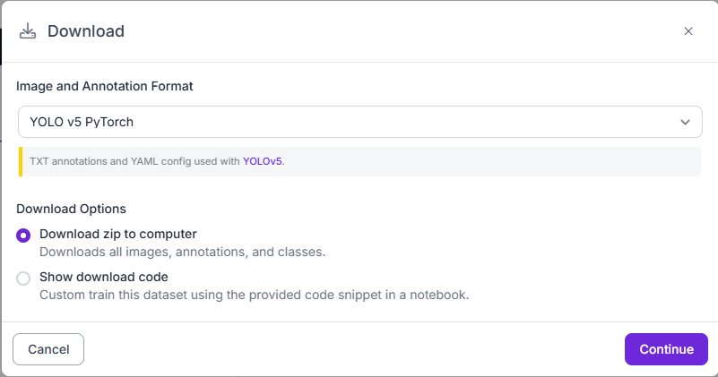
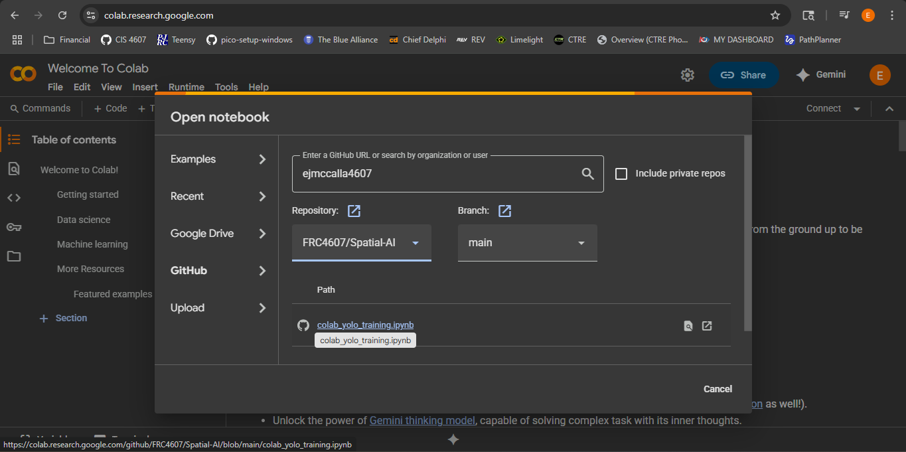
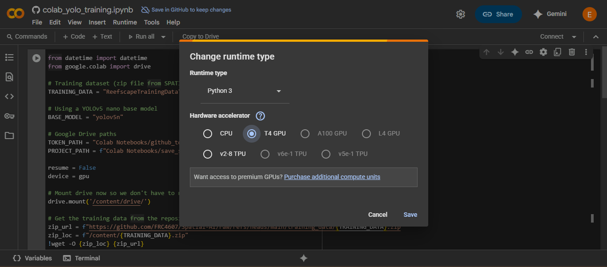
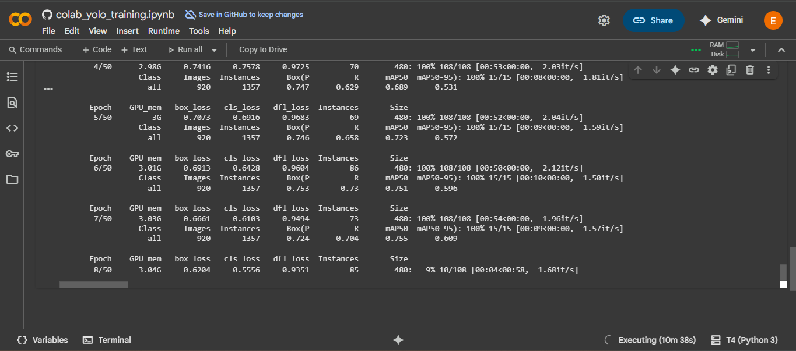
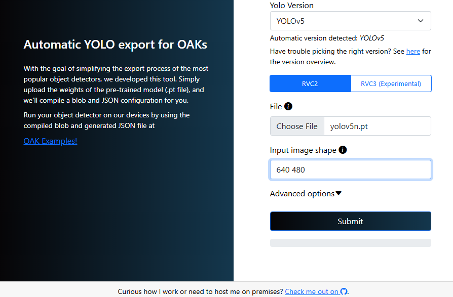
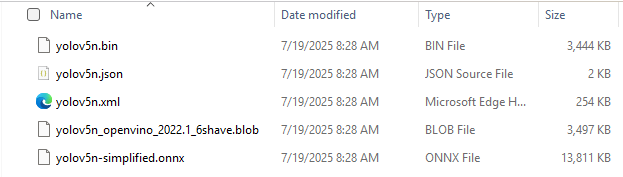

# 🧠 Spatial-AI

The goal of this project is to develop the tools and processes necessary to provide **timely and reliable robot-relative game piece detection** to the robot controller via WPILib NetworkTables. This is achieved by using an Oak-D camera and running the FRC4607 SpatialAI service on a Raspberry Pi.

This system supports two primary modes: **Development** and **Competition**.

🔧 Development Mode

- The FRC4607 Spatial AI service connects to NT4 using `host-spatial-ai.local`, starts up on boot, and can be used view spatial inferencing and recording via NT control
- Or SSH into the Raspberry Pi using `frc4607@frc4607-spatial-ai`, stop the FRC4607 Spatial AI service, and run `spatial-inference` to view the stream
- Or while SSH'd into the Raspberry Pi, run `recorder` to capture video and save it to the attached USB drive for later playback

🏁 Competition Mode

- The FRC4607 Spatial AI service will connect to NT4 using team number 4607 and **Inferencing** is started during bootup 
- **Recording** to the attached USB drive is triggered by start/stop signals received from the robot code

🐞 Debugging

- Use `replay` on a laptop to play recorded video files and view inferencing results

---

## 📚 Table of Contents

- [🔧 Hardware](#-hardware)
- [💻 Software](#-software)
- [🍓 1. Setting Up the Raspberry Pi 4B](#-1-setting-up-the-raspberry-pi-4b)
- [📸 2. Gathering the Training Images](#-2-gathering-the-training-images)
- [🧹 3. Preparing the Training Images](#-3-preparing-the-training-images)
- [🧠 4. Training the YOLO Model](#-4-training-the-yolo-model)
- [🚀 5. Running the YOLO Model](#-5-running-the-yolo-model)

---

## 🔧 Hardware

This project uses the following hardware:

🔗 [**OAK-D Lite**](https://shop.luxonis.com/products/oak-d-lite-1?variant=42583102456031)  
- B&W Stereo + color camera in one compact device  
- Provides both object detection and 3D location (relative to the camera)

🔗 [**Raspberry Pi 5**](https://www.raspberrypi.com/products/raspberry-pi-5/)  
- Hosts the OAK-D Lite camera  
- Runs inference and publishes results to NetworkTables
- Streams annotated images to CameraServer
- Captures video streams to a connected USB drive

---

## 💻 Software

The following software packages and tools are required:

- 🔗 [**Python 3**](https://www.python.org/) – Core runtime environment on the Raspberry Pi
- 🔗 [**pyntcore**](https://pypi.org/project/pyntcore/) – NetworkTables client library
- 🔗 [**robotpy-cscore**](https://pypi.org/project/robotpy-cscore/) – RobotPy bindings for cscore image processing library
- 🔗 [**DepthAI & SDK**](https://github.com/luxonis/depthai/blob/main/depthai_sdk/README.md) – Interface to the OAK-D camera
- 🔗 [**Luxonis YOLO Converter**](https://tools.luxonis.com/) – YOLOv5/v8 `.blob`converter

---

## 🍓 1. Setting Up the Raspberry Pi 5

📝 Use a custom Raspberry Pi 5 image with:

- Raspberry Pi OS Lite (64-bit, headless)
- SSH enabled
- Bluetooth, WiFi, and Audio HW disabled
- Several unused services disabled
- Setup this project and virtual environment

### ⚙️ Steps
The following assumes the setup will be done from a Windows PC.

1. Download and install Raspberry Pi OS Lite to a micro SD card using [Raspberry Pi Imager](https://www.raspberrypi.com/documentation/computers/getting-started.html#raspberry-pi-imager)
   - In "Edit Settings":
     - **Hostname**: `frc4607-spatial-ai`
     - **Username**: `frc4607`
     - **Password**: `frc4607`
   - Under "Services":  
     ✅ Enable SSH and password authentication

2. Clone this repo to your PC

3. From a command prompt at the projects root, run `setup.bat` to setup the virtual environment

4. From a PowerShell on your PC, run the command below to completely setup the Raspberry PI:
```.\setup_pi.ps1 -User "yourname" -Email "yourname@example.com"```

5. For development and debug, install powershell convenience functions by running the following:
```.\setup_pi_commands.ps1```
This will provide the following one-liners:
`servicestatus` Get FRC4607 Spatial AI service status
`servicestart` Start Spatial AI service
`servicestop` Stop Spatial AI service
`servicerestart` Restart Spatial AI service
`viewlogs` View Spatial AI service logs (last 1000)
`followlogs` View Spatial AI service logs (realtime)
`deletelogs` Delete Spatial AI service logs
`copyrecordings` Copy USB recordings to local PC
`fixrecordings` Fix USB recordings permissions (if needed)
`setcompmode` Set PI SPATIAL_AI_MODE env variable to comp mode
`setdevmode` Set PI SPATIAL_AI_MODE env variable to dev mode
`setreslow` Set PI RESOLUTION env variable to low
`setresmed` Set PI RESOLUTION env variable to med
`setreshigh` Set PI RESOLUTION env variable to high

🔗 [Raspberry Pi Docs](https://www.raspberrypi.com/documentation/computers/raspberry-pi.html)  
🔗 [Embedded Pi Setup Resource](https://github.com/johnwinans/raspberry-pi-install)

---

## 📸 2. Gathering the Training Images

### Best Practices:

- Use the **robot-mounted OAK-D Lite** to capture all training data
- Gather the core dataset at the BRIC field (done prior to regional play):
  - Vary the lighting, backgrounds, and robot poses
- Supplement the dataset using curated screenshots from match video gathered throughout the competition season

🎯 **Goal**: Create a focused, high-quality dataset  
> Remember - “Don't try to boil the ocean.”

---

## 🧹 3. Preparing the Training Images

The team will use our [Roboflow - FRC4607 Workspace](https://app.roboflow.com/frc4607) to manage the preperation of the training images. 

### Steps:

1. **Annotate** – Annotating images consists of drawing bounding boxes and assigning class labels [2006-REBUILT Annotation](https://app.roboflow.com/frc4607/2026-rebuilt-d0wrw/annotate)
2. **Format** – The training images need to be eported in the YOLOv5 model format [2006-REBUILT Versions](https://app.roboflow.com/frc4607/2026-rebuilt-d0wrw/generate/empty)

3. **Update the ZIP** - Replace the relative folders with absolute ones in `data.yaml`. For example, replace the following:
`train: ../train/images`
`val: ../valid/images`
`test: ../test/images`
with
`train: /content/<zip_file_name>/valid/images`
`val: /content/<zip_file_name>/valid/images`
`test: /content/<zip_file_name>/valid/images`

🔗 [Ultralytics Data Annotation Guide](https://docs.ultralytics.com/guides/data-collection-and-annotation/#introduction)

---

## 🧠 4. Training the YOLO Model

We use **[YOLOv5](https://docs.ultralytics.com/yolov5/)** to train models on our dataset. As the dataset grows throughout the season, we continuously retrain. Training is done using **Google Colab**, with outputs saved to Google Drive. The GitHub auto-commit feature uses a GitHub token for uploads.

### 🔐 Setup:

- Create a folder named `Google Colab` at the root of the Google Drive
- Add a file named `github_token.txt` inside that folder (the contents must be the GitHub token)

### ✅ Colab Training Steps:

1. Open the notebook from GitHub  
   

2. Enable GPU:  
   `Runtime` → `Change runtime type` → `GPU`  
   

3. Run cells and monitor progress actively  
   > Colab disconnects if idle  
   

4. Once training finishes, the `.pt` file is saved to the `models/` directory

5. Convert the PyTorch model using the [Luxonis Model Converter](https://tools.luxonis.com/)  
   

6. Download and extract the `results.zip` to the same directory as your `.pt` file  
   

> ⚠️ Ignore deprecation warning and do **not** use [Luxonis HubAI](https://hub.luxonis.com/ai) for now. The DepthAI SDK v2 still depends on the older format.

---

## 🚀 5. Running the YOLO Model

🚧 _Coming soon: Real-time inference with DepthAI SDK and NetworkTables messaging._
